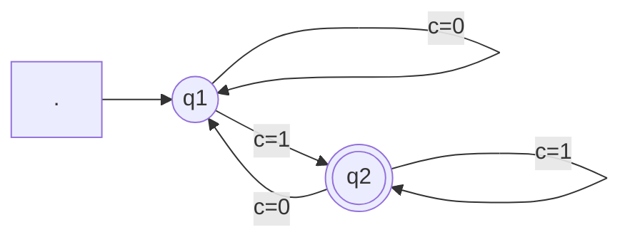
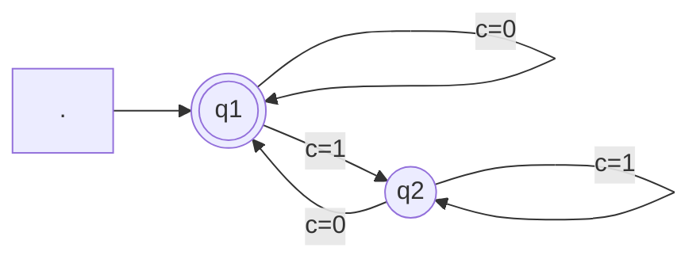
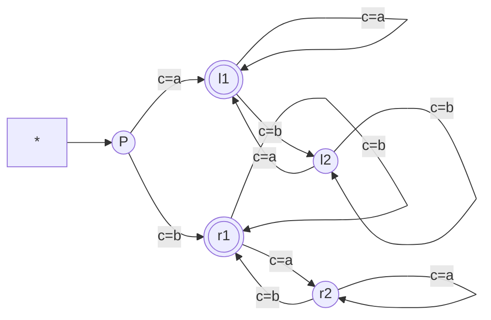

# 复杂度表示

大O表示法的定义(Bachmann–Landau Notations)
已知计算用时函数$f,g: \mathbb{N} \to \mathbb{R}$, 则
1. 渐进上限: $f=O(g) \iff \exists c>0, \exists N, \forall n\geq N, f(n)\leq c\cdot g(n)$
2. 渐进下限: $f=\Omega(g) \iff \exists c>0, \exists N, \forall n\geq N, f(n)\geq c\cdot g(n)$
3. 远远小于: $f=o(g) \iff \forall c>0, \exists N, \forall n\geq N, f(n)< c\cdot g(n)$
4. 远远大于: $f=w(g) \iff \forall c>0, \exists N, \forall n\geq N, f(n)> c\cdot g(n)$
5. 渐进约束: $f=\Theta(g) \iff \exists c_1,c_2>0, \exists N, \forall n\geq N, c_1\cdot g(n)\leq f(n)\leq c_2\cdot g(n)$
6. 渐进相等: $f=\theta(g) \iff f\sim g \iff \lim_{n\to\infty}\frac{f(n)}{g(n)}=1$

 

大O表示法的性质
1. $f=O(g)\iff k\cdot f=O(g)$
2. $f_1=O(g_1) \land f_2=O(g_2) \implies f_1+f_2=O(\max(g_1,g_2))$
3. $f_1=O(g_1) \land f_2=O(g_2) \implies f_1\cdot f_2=O(g_1\cdot g_2)$

上述命题的证明:
1. $f=O(g) \iff \exists c>0, \exists N, \forall n\geq N, f(n)\leq c\cdot g(n) \iff \exists k>0, \exists N, \forall n\geq N, (k\cdot f)(n)\leq (k\cdot c)\cdot g(n) \iff k\cdot f=O(g)$
2. $f_1=O(g_1) \land f_2=O(g_2) \iff$
    $\exists c_1,c_2>0, \exists N_1,N_2, [\forall n\geq N_1, f_1(n)\leq c_1\cdot g_1(n)]\land[\forall n\geq N_2, f_2(n)\leq c_2\cdot g_2(n)]$
    $\implies \forall n\geq\max(N_1,N_2), f_1(n)+f_2(n)\leq c_1\cdot g_1(n)+c_2\cdot g_2(n)\leq 2\max(c_1,c_2)\cdot\max(g_1(n),g_2(n))$
    $\implies f_1+f_2=O(\max(g_1,g_2))$
3. $f_1=O(g_1) \land f_2=O(g_2) \iff$
    $\exists c_1,c_2>0, \exists N_1,N_2, [\forall n\geq N_1, f_1(n)\leq c_1\cdot g_1(n)]\land[\forall n\geq N_2, f_2(n)\leq c_2\cdot g_2(n)]$
    $\implies \forall n\geq\max(N_1,N_2), f_1(n)\cdot f_2(n)\leq c_1\cdot g_1(n)\cdot c_2\cdot g_2(n)\leq (c_1\cdot c_2)\cdot g_1(n)\cdot g_2(n)$
    $\implies f_1\cdot f_2=O(g_1\cdot g_2)$

 

| 英文名              | 大O表示法           |  中文名  |
| ------------------- | ------------------- | :------: |
| Constant            | $O(1)$              |   常数   |
| Double Logarithimic | $O(\log\log n)$     | 双重对数 |
| Logarithimic        | $O(\log n)$         |   对数   |
| Polylogarithimic    | $O((\log n)^c)$     |  多对数  |
| Fractional Power    | $O(n^c), c\in(0,1)$ |  分数幂  |
| Linear              | $O(n)$              |   线性   |
| Linearithmic        | $O(n\log n)$        | 对数线性 |
| Quadratic           | $O(n^2)$            |   平方   |
| Polynomial          | $O(n^c)$            |  多项式  |
| Exponential         | $O(c^n)$            |   指数   |
| Factorial           | $O(n!)$             |   阶乘   |

# 字母表, 字符串, 语言

字母表的定义(Alphabet)
任意非空有限集合$\Sigma$称为字母表, 其中的元素称为符号

字母表上的字符串的定义(String)
已知字母表$\Sigma$, 将有限序列$w=(c_1,c_2,\cdots,c_n), c_i\in\Sigma$称为字母表$\Sigma$上的字符串
字符串的符号数称为字符串的长度, 记为$|w|$,
将长度为0的字符串称为空串, 记为$\epsilon=()$

将字母表上长度为$n$的字符串的集合记为$\Sigma^n,n\in\mathbb{N}$
将字母表上所有字符串的集合记为全字符串集$\Sigma^*=\bigcup_{n=0}^{\infty}\Sigma^n$

字符串连接的定义(Concatenation)
已知字母表$\Sigma$, 以及其上的字符串$x=(x_1,\cdots,x_n), y=(y_1,\cdots,y_m)$,
则$x,y$的连接记为$x\cdot y=(x_1,\cdots,x_n,y_1,\cdots,y_m)$
字符串的连接满足结合律, 且空串$\epsilon$为单位元, 故$[\Sigma^*,\cdot]$是幺半群

递归地定义$x_1x_2\cdots x_n=(x_1x_2\cdots x_{n-1})(x_n)$
$[\Sigma^*,\cdot]$是幺半群, 故满足广义结合律, 可以任意添加括号
其中规定$x^0=\epsilon, x^n=\underbrace{x\cdots x}_{n\text{个}}(n\ge1)$

子串的定义(SubString)
已知字母表$\Sigma$, 以及其上的字符串$v,w$, 
若存在字符串$x,y$, 使得$w=xvy$, 则称$v$为$w$的子串
如果$\exists s\in\Sigma^*, w=vs$, 则称$v$为$w$的前缀(Prefix)
如果$\exists s\in\Sigma^*, w=sv$, 则称$v$为$w$的后缀(Suffix)

字符串反转的定义(Reverse)
已知字母表$\Sigma$, 以及其上的字符串$w=(c_1,c_2,\cdots,c_n)$,
则$w$的反转记为$w^R=(c_n,c_{n-1},\cdots,c_1)$
多字符串连接的反转$(xy)^R=y^Rx^R$

 

语言的定义(Language)
已知字母表$\Sigma$, 则全字符串集$\Sigma^*$的子集称为$\Sigma$上的语言, 记为$L\subseteq\Sigma^*$
例如$\emptyset,\{\epsilon\},\Sigma^n,\Sigma^*$都是$\Sigma$上的语言, 需要注意$\emptyset$和$\{\epsilon\}$是两个不同的语言

语言的交集的定义(Intersection)
已知字母表$\Sigma$, 以及其上的语言$L_1,L_2$, 则$L_1,L_2$的交集为$L_1\cap L_2$

语言的并集的定义(Union)
已知字母表$\Sigma$, 以及其上的语言$L_1,L_2$, 则$L_1,L_2$的并集为$L_1\cup L_2$

语言的差集的定义(Difference)
已知字母表$\Sigma$, 以及其上的语言$L_1,L_2$, 则$L_1,L_2$的差集为$L_1-L_2$

语言的补集的定义(Complement)
已知字母表$\Sigma$, 以及其上的语言$L$, 则$L$的补集为$\bar{L}=\Sigma^*-L$

 

语言连接的定义(Concatenation)
已知字母表$\Sigma$, 以及其上的语言$L_1,L_2\subseteq\Sigma^*$, 
则$L_1,L_2$的连接为$L_1\cdot L_2=\{xy|x\in L_1,y\in L_2\}$
语言的连接满足结合律, 且$L=\{\epsilon\}$为单位元, 故$[\forall L,\cdot]$是幺半群
空语言$\emptyset$ 的作用类似于自然数集中的零元

递归地定义$L_1L_2\cdots L_n=(L_1L_2\cdots L_{n-1})L_n$
$[\forall L,\cdot]$是幺半群, 故满足广义结合律, 可以任意添加括号
其中规定$L^0=\{\epsilon\}, L^n=\underbrace{L\cdots L}_{n\text{个}}(n\ge1)$

语言的克林闭包的定义(Kleene Closure)
<也就是语言子集所生成的子幺半群>
已知字母表$\Sigma$, 以及其上的语言$L\subseteq\Sigma^*$, 
则$L$的Kleene闭包为$L^*=\bigcup_{n=0}^{\infty}L^n=\{\epsilon\}\cup L\cup L^2\cup\cdots$, 特别地 $\emptyset^*=\{\epsilon\}$
1. 运算封闭: $\forall w_1,w_2\in L^*,w_1\in L^x, w_2\in L^y, w_1w_2\in L^{x+y}\implies w_1w_2\in L^*$
2. 结合律: $L^*\subseteq\Sigma^*\implies L^*$的字符串满足结合律
3. 单位元: $\epsilon\in L^0\subseteq L^*$

语言的正闭包的定义(Positive Closure)
已知字母表$\Sigma$, 以及其上的语言$L$, 则$L$的正闭包为$L^+=\bigcup_{n=1}^{\infty}L^n=L\cup L^2\cup\cdots$

 

计算性问题(Computation Problem)
从字符串到字符串的映射, 即$f:\Sigma^*\to\Sigma^*$, 称为计算性问题

判定性问题(Decision Problem)
从字符串到布尔值的映射, 即$f:\Sigma^*\to\{0,1\}$, 称为判定性问题
或者也可以将该映射记为语言$L$, 其中上述布尔值映射为其特征函数

 

# 正则语言

## 有限状态机

确定性有限状态机的定义(Deterministic Finite Automaton)
5元组$M=(Q,\Sigma,q_0,F,\delta)$称为确定性有限状态机, 其中
1. 状态集: 有限集合$Q$
2. 字母表: 有限集合$\Sigma$
3. 初始状态: $q_0\in Q$
4. 接受状态集: $F\subseteq Q$
5. 转移函数: $\delta: Q\times\Sigma\to Q$

 

示例1: $M_1=(Q=\{q_1,q_2\},\Sigma=\{0,1\},q_1,F=\{q_2\},\delta)$
如图可知, $L(M_1)=\{w|w.endwith(1)\}$

 

示例2: $M_2=(Q=\{q_1,q_2\},\Sigma=\{0,1\},q_1,F=\{q_1\},\delta)$
如图可知, $L(M_2)=\{w|w.startwith(0)\lor w=\epsilon\}$

 

示例3: $M_3=(Q=\{P,l1,l2,r1,r2\},\Sigma=\{a,b\},P,F=\{l1,r1\},\delta)$
如图可知: $L(M_3)=\{w|w.startwith(a).endwith(a)\lor w.startwith(b).endwith(b)\}$

  

非确定性有限状态机的定义(Non-deterministic Finite Automaton)
5元组$N=(Q,\Sigma,q_0,F,\delta)$称为非确定性有限状态机, 其中
1. 状态集: 有限集合$Q$
2. 字母表: 有限集合$\Sigma$
3. 初始状态: $q_0\in Q$
4. 接受状态集: $F\subseteq Q$
5. 转移函数: $\delta: Q\times\Sigma\cup\{\epsilon\}\to P(Q)$

 

示例1: $N_1=(Q=\{q_1,q_2,q_3,q_4\},\Sigma=\{0,1\},q_1,F=\{q_4\},\delta)$

| $\delta$ | 0           | 1             | ϵ           |
| -------- | ----------- | ------------- | ----------- |
| $q_1$    | $\{q_1\}$   | $\{q_1,q_2\}$ | $\emptyset$ |
| $q_2$    | $\{q_3\}$   | $\emptyset$   | $\{q_3\}$   |
| $q_3$    | $\emptyset$ | $\{q_4\}$     | $\emptyset$ |
| $q_4$    | $\{q_4\}$   | $\{q_4\}$     | $\emptyset$ |

 

| $\delta$ | 0           | 1                 |
| -------- | ----------- | ----------------- |
| $q_1$    | $\{q_1\}$   | $\{q_1,q_2,q_3\}$ |
| $q_2$    | $\{q_3\}$   | $\emptyset$       |
| $q_3$    | $\emptyset$ | $\{q_4\}$         |
| $q_4$    | $\{q_4\}$   | $\{q_4\}$         |

$\Epsilon(q_2)=\{q_2,q_3\}$

 

示例2: 已知语言$L_3=\{0^k=\underbrace{0\cdots0}_k,2|k\lor3|k\}$, 则其NFA为

  

DFA $\iff$ NFA
确定性有限状态机 等价于 非确定性有限状态机
$\implies$: 每个DFA都是NFA, 得证
$\impliedby$: 设NFA有k个状态, 则它有$2^k$种状态子集
已知识别语言$A\subseteq\Sigma^*$的NFA为$N=(Q,\Sigma,q_0,F,\delta)$
现欲构造DFA为$M=(Q',\Sigma,q_0',F',\delta')$, 使得$L(M)=A$
定义点集R能够沿$\epsilon$到达的点的集合$\Epsilon(R)=\{q\in Q|\exists r\in R, q\in\delta^k(r,\epsilon),k\in\mathbb{N}\}$
1. 状态集: $Q'=2^Q=\{S|S\subseteq Q\}$
2. 字母表: $\Sigma=\Sigma$
3. 起始状态: $q_0'=\Epsilon(\{q_0\})$
4. 接受状态集: $F'=\{R\in 2^Q|R\cap F\neq\emptyset\}$
5. 转移函数: $\delta'(R,c)=\bigcup_{r\in R}\Epsilon[\delta(r,c)]$

示例:

  

有限状态机所接受的字符串的定义(String of Finite Automaton)
已知有限状态机$M=(Q,\Sigma,q_0,F,\delta)$,
如果M接受字符串$w=(c_1,c_2,\cdots,c_n)\in\Sigma^*$,
那么就存在状态序列$(q_0,q_1,\cdots,q_n), q_i\in Q$满足
1. 初始状态: $q_0=q_0$
2. 递推过程: $\delta(q_i,c_{i+1})=q_{i+1},i\in\{0,\cdots,n-1\}$
3. 终止状态: $q_n\in F$

有限状态机所接受的语言的定义(Language of Finite Automaton)
已知有限状态机$M=(Q,\Sigma,q_0,F,\delta)$, 
则其接受的语言为$L(M)=\{w\in\Sigma^*|\delta(q_0,w)\in F\}$
如果该机器不接受任何字符串, 那么$L(M)=\emptyset$

## 正则语言

正则语言的定义(Regular Language)
已知字母表$\Sigma$, 其上有语言$A\subseteq\Sigma^*$,
如果存在有限状态机$M$, 使得$L(M)=A$, 则称$A$为正则语言

 

正则语言在并运算下封闭

通过构造DFA证明: 已知正则语言$A_1\leftrightarrow M_1,A_2\leftrightarrow M_2$
其中$M_1=(Q_1,\Sigma,q_1,F_1,\delta_1),M_2=(Q_2,\Sigma,q_2,F_2,\delta_2)$
现欲构造有限状态机M, 使得$A_1\cup A_2\leftrightarrow M=(Q,\Sigma,q_0,F,\delta)$
1. 状态集: $Q=Q_1\times Q_2=\{(q_1,q_2)|q_1\in Q_1,q_2\in Q_2\}$
2. 字母表: $\Sigma=\Sigma$
3. 初始状态: $q_0=(q_1,q_2)$
4. 接受状态集: $F=\{(r_1,r_2)|r_1\in F_1\lor r_2\in F_2\}$
5. 转移函数: $\delta((q_1,q_2),c)=(\delta_1(q_1,c),\delta_2(q_2,c))$

通过构造NFA证明: 已知正则语言$A_1\leftrightarrow N_1,A_2\leftrightarrow N_2$
其中$N_1=(Q_1,\Sigma,q_1,F_1,\delta_1),N_2=(Q_2,\Sigma,q_2,F_2,\delta_2)$
现欲构造有限状态机N, 使得$A_1\cup A_2\leftrightarrow N=(Q,\Sigma,q_0,F,\delta)$
1. 状态集: $Q=\{q_0\}\cup Q_1\cup Q_2$
2. 字母表: $\Sigma=\Sigma$
3. 起始状态: $q_0$
4. 接受状态集: $F=F_1\cup F_2$
5. 转移函数: $\delta(q,a)
=\left\{\begin{array}{ll}
\delta_1(q,a) &q\in Q_1\\
\delta_2(q,a) &q\in Q_2\\
\{q_1,q_2\} &q=q_0\land c=\epsilon\\
\emptyset &q=q_0\land c\neq\epsilon\\
\end{array}\right.$

 

正则语言在连接运算下封闭
通过构造NFA证明: 已知正则语言$A_1\leftrightarrow N_1,A_2\leftrightarrow N_2$
其中$N_1=(Q_1,\Sigma,q_1,F_1,\delta_1),N_2=(Q_2,\Sigma,q_2,F_2,\delta_2)$
现欲构造有限状态机N, 使得$A_1\circ A_2\leftrightarrow N=(Q,\Sigma,q_0,F,\delta)$
1. 状态集: $Q=Q_1\cup Q_2$
2. 字母表: $\Sigma=\Sigma$
3. 起始状态: $q_0=q_1$
4. 接受状态集: $F=F_2$
5. 转移函数: $\delta(q,a)
=\left\{\begin{array}{ll}
\delta_1(q,a) &q\in Q_1\land q\notin F_1\\
\delta_1(q,a) &q\in F_1\land a\neq\epsilon\\
\delta_1(q,\epsilon)\cup\{q_2\} &q\in F_1\land a=\epsilon\\
\delta_2(q,a) &q\in Q_2\\
\end{array}\right.$

 

正则语言在闭包运算下封闭
通过构造NFA证明: 已知正则语言$A_1\leftrightarrow N_1=(Q_1,\Sigma,q_1,F_1,\delta_1)$
现欲构造有限状态机N, 使得$A_1^*\leftrightarrow N=(Q,\Sigma,q_0,F,\delta)$
1. 状态集: $Q=\{q_0\}\cup Q_1$
2. 字母表: $\Sigma=\Sigma$
3. 起始状态: $q_0$
4. 接受状态集: $F=F_1\cup\{q_0\}$
5. 转移函数: $\delta(q,a)
=\left\{\begin{array}{ll}
\emptyset &q=q_0\land a\neq\epsilon\\
\{q_1\} &q=q_0\land a=\epsilon\\
\delta_1(q,a) &q\in Q_1\land q\notin F_1\\
\delta_1(q,a) &q\in F_1\land a\neq\epsilon\\
\delta_1(q,\epsilon)\cup\{q_1\} &q\in F_1\land a=\epsilon\\
\end{array}\right.$

## 正则表达式

正则表达式的定义(Regular Expression)
已知字母表$\Sigma$, 则$\Sigma$上的正则表达式定义如下
1. $\emptyset\iff L(\emptyset)=\emptyset$
2. $\epsilon\iff L(\epsilon)=\{\epsilon\}$
3. $a\in\Sigma\iff L(a)=\{a\}$
4. $R_1^*\iff L(R_1^*)=L(R_1)^*$
5. $R_1\circ R_2\iff L(R_1\circ R_2)=L(R_1)\circ L(R_2)$
6. $R_1\cup R_2\iff L(R_1\cup R_2)=L(R_1)\cup L(R_2)$
7. $(*)>(\circ)>(\cup)$

语言是正则语言, 当且仅当可以用正则表达式描述
$\impliedby$: 欲找出每种正则表达式对应的有限状态机
1. $\emptyset\iff L(\emptyset)=\emptyset$: 
2. $\epsilon\iff L(\epsilon)=\{\epsilon\}$: 
3. $a\in\Sigma\iff L(a)=\{a\}$: 
4. $R_1^*,R_1\circ R_2,R_1\cup R_2$: 正则语言运算封闭

$\implies$: 欲将DFA转换为等价的正则表达式(需要GNFA)

 

广义非确定性有限状态机的定义(Generalized Non-deterministic Finite Automaton)
<转移函数为正则表达式的NFA>
5元组$N=(Q,\Sigma,q_{start},q_{accept},\delta)$称为广义非确定性有限状态机, 其中
1. 状态集: 有限集合$Q$
2. 字母表: 有限集合$\Sigma$
3. 起始状态: $q_{start}\in Q$
4. 接受状态: $q_{accept}\in Q$
5. 转移函数: 类似网络流, 且任何状态到自身和其他状态都有箭头
    $\delta: Q\setminus\{q_{accept}\}\times Q\setminus\{q_{start}\}\to\mathcal{R}$,
    其中$\mathcal{R}$是 该状态转移 对应接收的正则表达式
    (已证明正则表达式对应的语言是正则语言)

将DFA转换为对应的GNFA
1. 添加新的起始状态和接受状态
2. 新起始状态$\overset{\epsilon}{\to}$原起始状态
2. 原接受状态集$\overset{\epsilon}{\to}$新接受状态
3. 将多个同向箭头合并为正则表达式的并

GNFA转换为正则表达式: CONVERT(G)
1. 已知G的状态数为k
2. 如果k=2, 返回最终的正则表达式
3. 如果k>2, 任取状态$q_{rip}\in Q\setminus\{q_{start},q_{accept}\}$
    构造$G'=\text{GNFA}(Q',\Sigma,q_{start},q_{accept},\delta')$, 其中$Q'=Q\setminus\{q_{rip}\}$
    并且对任意$q_i\in Q'\setminus\{q_{accept}\},q_j\in Q'\setminus\{q_{start}\}$
    转移函数更新为$\delta'(q_i,q_j)=R_1R_2^*R_3\cup R_4$, 其中
    $R_1=\delta(q_i,q_{rip}),R_2=\delta(q_{rip},q_{rip}),R_3=\delta(q_{rip},q_j),R_4=\delta(q_i,q_j)$
4. 继续计算 CONVERT(G')

## 非正则语言

泵引理(Pumping Lemma)
已知正则语言A, 则存在泵长度p (NFA状态数)
使得对于A中任意长度不小于p的字符串
都可以分成三段, 即s=xyz, 且满足
1. $\forall i\in\mathbb{N}, xy^iz\in A$
2. $|xy|\le p$
3. $|y|>0$

证明: 已知识别A的DFA为$M=(Q,\Sigma,q_1,F,\delta)$, 其状态数为p
取A中长度为n的字符串$s=s_1s_2\cdots s_n$, 其中$n\ge p$
则M处理s时经过的状态序列为$r_1,r_2,\cdots,r_{n+1}$
因为$n\ge p\implies n+1\ge p+1>p$, 
故由鸽笼原理可知 前p+1个状态中会出现重复
将第一处记为$r_a$, 第二处记为$r_b$
$r_1(\overset{s_1}{\to}r_2\overset{s_2}{\to}\cdots\overset{s_{a-1}}{\to})r_a(\overset{s_a}{\to}\cdots\overset{s_{b-1}}{\to})r_b(\overset{s_b}{\to}\cdots\overset{s_n}{\to})r_{n+1}$
令$x=s_1\cdots s_{a-1},y=s_a\cdots s_{b-1},z=s_b\cdots s_n$
1. $r_a\overset{y}{\to}r_a\implies\forall i\in\mathbb{N}, xy^iz\in A$
2. $a<b\le p+1\implies |xy|=b-1\le p$
3. $a<b\implies a\le b-1\implies y=s_a\cdots s_{b-1}\neq\epsilon\implies|y|>0$

# 上下文无关文法

上下文无关文法的定义(Context-free Grammar)
4元组$G=(V,\Sigma,S,R)$称为上下文无关文法, 其中
1. 变元集: 有限集合$V$
2. 终结符集: 有限集合$\Sigma\cap V=\emptyset$
3. 起始变元: $S\in V$
4. 有穷规则集: $\{V^*\to(V\cup\Sigma)^*\}$

若文法规则满足$A\to w$, 则称uAv生成uwv
若存在$u\to u_1\to\cdots\to v$, 则称u派生v, 记为$u\to^* v$
将文法的语言定义为$L(G)=\{w\in\Sigma^*|S\to^* w\}$

上下文无关语言的定义(Context-free Language)
已知字母表$\Sigma$, 其上有语言$A\subseteq\Sigma^*$,
如果存在上下文无关文法$G$, 使得$L(G)=A$, 则称$A$为上下文无关语言

 

示例1: 已知语言$L=\{0^n\#1^n|n\ge0\}$
构造上下文无关文法$G_1=(V,\Sigma,S,R)$
1. 变元集: $V=\{A,B\}$
2. 终结符集: $\Sigma=\{0,1,\#\}$
3. 起始变元: $A$
4. 有穷规则集: $\\A\to0A1\\A\to B\\B\to\#$

示例2: 已知语言为符合基础英文语法的句子
构造上下文无关文法$G_2=(V,\Sigma,S,R)$
1. 变元集: $V=\{<\cdots>\}$
2. 终结符集: $\Sigma=\{a,b,\cdots,z,\square\}$
3. 起始变元: $<SENT>$
4. 有穷规则集: 

示例3: 已知语言为所有嵌套正常的括号字符串
构造上下文无关文法$G_3=(\{S\},\{(,)\},S,\{S\to(S)\mid SS\mid\epsilon\})$

示例4: 已知语言为加乘运算表达式
构造上下文无关文法$G_4=(V,\Sigma,S,R)$
1. 变元集: $V=\{[\text{EXPR}],[\text{TERM}],[\text{FACTOR}]\}$
2. 终结符集: $\Sigma=\{a,+,*,(,)\}$
3. 起始变元: $S=[\text{EXPR}]$
4. 有穷规则集: 
$[\text{EXPR}]\to[\text{EXPR}]+[\text{TERM}]\mid [\text{TERM}]$
$[\text{TERM}]\to[\text{TERM}]*[\text{FACTOR}]\mid [\text{FACTOR}]$
$[\text{FACTOR}]\to([\text{EXPR}])\mid a$

 

DFA $\implies$ CFG
将有限状态机 转换为 上下文无关文法
1. 对于DFA的状态$q_i$, 指定变元$R_i$
2. 对于DFA的转移函数$\delta(q_i,a)=q_j$, 有文法规则$R_i\to aR_j$
3. 对于DFA的接受状态$q_i$, 构造文法规则$R_i\to\epsilon$

 

最左派生的定义(Leftmost Derivation)
对于文法G中字符串w的派生,
如果其中每一步都是替换最左边的变元, 则称其为最左派生

歧义文法的定义(Ambiguous Grammar)
已知文法G, 有派生字符串w
如果对于w有多个不同的最左派生, 则称G歧义地产生字符串w
如果文法G会歧义地产生某个字符串, 则称G是歧义文法
如果语言L只能用歧义文法生成, 则称L是固有歧义的语言

 

乔姆斯基范式(Chomsky Normal Form)
已知上下文无关文法G,
如果它的每个规则都具有如下形式:
其中a是任意终结符, ABC是任意变元
BC不能是起始变元, 此外允许$S\to\epsilon$
1. $A\to BC$
2. $A\to a$

FCG $\implies$ CNF
任意文法 都可改写为 乔姆斯基范式
1. 处理起始变元: $S_0\to S$
2. 处理$\epsilon$规则: 删去$A\to\epsilon$
    $+$其余规则右侧中的A替换为$\epsilon$
    例如$R\to uAvAw\implies (R\to uAvw),(R\to uvAw),(R\to uvw)$
3. 处理单一规则: 删去$A\to B$
    $+$其余规则左侧中的B替换为A
    例如$B\to u\implies A\to u$
4. 处理多元规则: 删去$A\to u_1u_2\cdots u_k$
    $+(A\to u_1A_1),(A_1\to u_2A_2),\cdots,(A_{k-2}\to u_{k-1}u_k)$
5. 处理终结符: 删去$A_i\to uA_j$
    $+(A_i\to UA_j),(U\to u)$

## 下推自动机

(非确定性)下推自动机的定义(Pushdown Automaton)
6元组$P=(Q,\Sigma,\Gamma,q_0,F,\delta)$称为下推自动机, 其中
1. 状态集: 有限集合$Q$
2. 输入字母表: 有限集合$\Sigma$
3. 栈字母表: 有限集合$\Gamma$
4. 起始状态: $q_0\in Q$
5. 接受状态集: $F\subseteq Q$
6. 转移函数: $\delta:Q\times\Sigma_\epsilon\times\Gamma_\epsilon\to (Q\times\Gamma_\epsilon)^k$

示例1: 已知语言$L=\{0^n1^n|n\ge0\}$
构造下推自动机$M_1=(Q,\Sigma,\Gamma,q_1,F,\delta)$
1. 状态集: $Q=\{q_1,q_2,q_3,q_4\}$
2. 输入字母表: $\Sigma=\{0,1\}$
3. 栈字母表: $\Gamma=\{0,\$\}$
4. 起始状态: $q_1\in Q$
5. 接受状态集: $F=\{q_1,q_4\}$

# 图灵机

图灵机的定义(Turing Machine)
<类似于无限状态机>
7元组$M=(Q,\Sigma,\Gamma,q_0,q_{accept},q_{reject},\delta)$称为图灵机, 其中
1. 状态集: 有限集合$Q$
2. 输入字母表: 有限集合$\Sigma$
3. 纸带字母表: 有限集合$\Gamma$ ($\square\in\Gamma,\Sigma\subseteq\Gamma$)
4. 起始状态: $q_0\in Q$
5. 接受状态: $q_{accept}\in Q$
6. 拒绝状态: $q_{reject}\in Q$ ($q_{reject}\neq q_{accept}$)
7. 转移函数: $\delta:Q\times\Gamma\to Q\times\Gamma\times\{L,R\}$

图灵机的格局的定义(Configuration)
已知当前状态为q, 当前带子的内容为uv, 
读写头当前位置为v[0], 字符串v之后都为空白符
则将图灵机当前格局记为 $uqv:=u\overset{q}{v}$

如果左移转移函数满足$\delta(q_i,b)=(q_j,c,L)$
则称 格局$uaq_ibv$ 产生 格局$uq_jacv$

如果右移转移函数满足$\delta(q_i,b)=(q_j,c,R)$
则称 格局$uaq_ibv$ 产生 格局$uacq_jv$

图灵机所接受的字符串的定义(String of Turing Machine)
已知图灵机$M=(Q,\Sigma,\Gamma,q_0,q_{accept},q_{reject},\delta)$
如果M接受字符串$w=(s_1,s_2,\cdots,s_n)\in\Sigma^*$,
那么就说明存在格局序列$(C_0,C_1,\cdots,C_k),k\le n$ 满足
1. 初始格局: $C_0=q_0w$
2. 递推过程: $\delta(C_i,s_{i+1})=C_{i+1},i\in\{0,\cdots,k-1\}$
3. 终止状态: $C_k$是接受格局

图灵所接受的语言的定义(Language of Turing Machine)
已知图灵机$M=(Q,\Sigma,\Gamma,q_0,q_{accept},q_{reject},\delta)$
则其接受的语言为$L(M)=\{w\in\Sigma^*|\delta(C_0,w).q=q_{accept}\}$
如果该机器不接受任何字符串, 那么$L(M)=\emptyset$

图灵可识别的语言的定义(Turing-recognizable Language)
已知字母表$\Sigma$, 其上有语言$A\subseteq\Sigma^*$,
如果存在图灵机$M$, 使得$L(M)=A$, 则称$A$为图灵可识别的语言

 

判定器的定义(Decider)
<能够在有限步内识别>
已知非确定性图灵机$M$, 
如果M对于所有输入的所有分支都停机, 则称M为判定器

可判定的语言的定义(Decidable Language)
已知字母表$\Sigma$, 其上有语言$A\subseteq\Sigma^*$,
如果存在判定器$M$, 使得$L(M)=A$, 则称$A$为可判定的语言

 

示例1: 已知语言$B=\{w\#w|w\in\{0,1\}^*\}$
算法: 对于输入字符串w:
1. 在#两边对应的位置上来回移动, 检查这些对应位置是否包含相同的符号,
    如不是, 或者没有#, 则拒绝, 过程中将所有检查过的符号消为x
2. 当#左边的所有符号都被消去时, 检查#的右边是否还有符号,
    如果是, 则拒绝, 否则接受

构造图灵机$M_1=(Q,\Sigma,\Gamma,q_0,q_{accept},q_{reject},\delta)$
1. 状态集: $Q=\{q_1,\cdots,q_8,q_{accept},q_{reject}\}$
2. 输入字母表: $\Sigma=\{0,1\}$
3. 纸带字母表: $\Gamma=\{0,1,\#,x,\square\}$

读到左侧为0: $q_1,0\to q_2,x,R$
且右侧也为0: $q_4,0\to q_6,x,L$

读到左侧为1: $q_1,1\to q_3,x,R$
且右侧也为1: $q_5,1\to q_7,x,L$

重新回溯到左侧: $q_6\to q_7\to q_1$

示例2: 已知语言$A=\{0^{2^n}|n\in\mathbb{N}\}$
算法: 对于输入字符串w:
1. 除2: 从左往右扫描整个带子, 隔一个字符消去0
2. $2^0=1$: 如果带子上只剩下1个0, 则接受
3. $2^k$为偶数: 如果带子上剩下奇数个0(非1), 则拒绝
4. 返回带子最左端, 转到第一步

构造图灵机$M_2=(Q,\Sigma,\Gamma,q_0,q_{accept},q_{reject},\delta)$
1. 状态集: $Q=\{q_1,\cdots,q_5,q_{accept},q_{reject}\}$
2. 输入字母表: $\Sigma=\{0\}$
3. 纸带字母表: $\Gamma=\{0,x,\square\}$

图中$q_1,0\to q_2,\square,R$: 将最左端标记为$\square$
图中$q_2,0\to q_3,x,R$和$q_3,0\to q_4,x,R$: 负责消去一半的0
图中$q_5,(x\lor0)\to q_5,L$: 用于回溯到最左端

示例3: 已知乘法运算对应语言$C=\{a^ib^jc^k|i\times j=k\land(i,j,k\in\mathbb{N^+})\}$
算法: 对于输入字符串w:
1. 从左往右扫描输入, 确认具有形式$a^+b^+c^+$, 然后返回最左端
2. 消去1个a, 然后成对地消去bc. 如果还剩多余的b, 则拒绝
3. 如果还有a, 则恢复所有b, 再重复第2步
4. 如果没有a, 则检测所有c, 如果已全部消去则接受, 否则拒绝

示例4: 已知语言$E=\{\#x_1\#x_2\#\cdots\#x_n|x_i\in\{0,1\}^*\land(\forall x_i\neq x_j)\}$
依次比较$(x_1\_x_2,x_1\_x_3,\cdots,x_1\_x_n),(x_2\_x_3,\cdots,x_2\_x_n),\cdots,(x_{n-1}\_x_n)$
算法: 对于输入字符串w:
1. 在纸带最左端的符号的顶上做个记号
    如果此符号是空白符, 则接受
    如果此符号是#, 则进行下一步
    否则拒绝
2. 向右扫描至下一个#, 并在其顶上做第二个记号
    如果在遇到空白符之前没有遇到#, 则带子上只有x1, 因此接受。
3. 通过来回移动, 比较做了记号的#的右边的两个字符串
    如果它们相等, 则拒绝。
4. 将第二个记号向右移到下一个#上
    如果在碰到空白符之前没有遇到#, 说明该轮比较已经结束
    则将第一个记号右移, 并且将第二个记号移到第一个记号右边
    如果这时第二个记号还找不到#, 说明比较结束, 因而接受
5. 转到第3步继续执行

 

多带图灵机的定义(Multitape Turing Machine)
7元组$M=(Q,\Sigma,\Gamma,q_0,q_{accept},q_{reject},\delta)$称为多带图灵机, 其中
1. 状态集: 有限集合$Q$
2. 输入字母表: 有限集合$\Sigma$
3. 纸带字母表: 有限集合$\Gamma$ ($\square\in\Gamma,\Sigma\subseteq\Gamma$)
4. 起始状态: $q_0\in Q$
5. 接受状态: $q_{accept}\in Q$
6. 拒绝状态: $q_{reject}\in Q$ ($q_{reject}\neq q_{accept}$)
7. 转移函数^: $\delta:Q\times\Gamma^k\to Q\times\Gamma^k\times\{L,R,S\}^k$

用构造法来证明等价性:
已知k带图灵机M, 有输入字符串$w_1,\cdots,w_k$
其中$w_i=(s_{i1},s_{i2},\cdots,s_{it_i})$
1. 在单带图灵机S的纸带上放入$\#w_1\#\cdots\#w_k\#$
    并给其中每个字符串的首字符打标记, 
    得到$\#\dot{s}_{11}s_{12}\cdots s_{1t_1}\#\cdots\#\dot{s}_{k1}s_{k2}\cdots s_{kt_k}\#$
2. 依照多带图灵机的转移函数依次更新单带上的每个字符串
3. 如果在处理某个字符串时, 单带续写头向右移动到了#,
    则说明此时对应的多带读写头应处于空白区域,
    故在单带的该#字符处写入空白符, 并将其后的所有字符都后移一位
    然后再像之前一样继续模拟

 

内存图灵机的定义(RAM Turing Machine)

 

非确定性图灵机的定义(Non-deterministic Turing Machine)
<类似于非确定性无限状态机>
7元组$M=(Q,\Sigma,\Gamma,q_0,q_{accept},q_{reject},\delta)$称为非确定性图灵机, 其中
1. 状态集: 有限集合$Q$
2. 输入字母表: 有限集合$\Sigma$
3. 纸带字母表: 有限集合$\Gamma$ ($\square\in\Gamma,\Sigma\subseteq\Gamma$)
4. 起始状态: $q_0\in Q$
5. 接受状态: $q_{accept}\in Q$
6. 拒绝状态: $q_{reject}\in Q$ ($q_{reject}\neq q_{accept}$)
7. 转移函数: $\delta:Q\times\Gamma\to (Q\times\Gamma\times\{L,R\})^k$

用广度优先遍历来证明等价性:
构造有三条纸带的图灵机
输入带: 包含输入串, 且不再改变
地址带: 选择模拟带执行的分支, 按字符串顺序递增
模拟带: 按照地址带所对应的NTM分支, 对输入进行模拟
例如若该NTM最多有3个分支, 则地址带依次递增$(1)\to(2)\to(3)\to(11)\to(12)\to\cdots$

1. 开始时, 输入带包含输入字符串w, 地址带和模拟带都为空
2. 将地址带的分支路径初始化为$\epsilon$, 并把输入带拷贝到模拟带
3. 用模拟带去模拟NTM的一个分支, 参照地址带来进行分支跳转
    如果地址带耗尽, 或者该跳转分支无效, 则放弃此分支, 转到第4步
    如果遇到接受格局, 则接受这个输入
    如果遇到拒绝格局, 则转到第4步, 
4. 递增地址带, 转到第3步来继续模拟下一个可能的分支

 

丘奇图灵论题(Church-Turing Thesis)
算法的直观概念, 等价于图灵机算法

希尔伯特第十问题(Hilbert's Tenth Problem)
设计一个<算法>来检测一个多项式是否有整数根
<算法>: 通过有限次运算就可以决定的过程
构造集合$D=\{p|p是有整数根的多项式\}$
问集合D是不是可判定的? 答案是否定的

描述图灵机的术语
1. 形式化描述: 构造图灵机的状态, 转移函数
2. 实现描述: 移动读写头, 纸带如何存储数据
3. 高层次描述: 用日常语言来描述算法

首先将对象O编码成字符串$\langle O\rangle$
然后用带引号的文字段描述图灵机的算法

示例: 已知语言$A=\{\langle G\rangle|G\text{是连通无向图}\}$
构造图灵机 M=输入是图G的编码$\langle G\rangle$
1. 选择G的第一个顶点并标记
2. 重复下列步骤, 知道没有新的可标记点
3. 对于G的每一个未标记点, 如果有边能到达已标记点, 则打上标记
4. 扫描G的所有顶点, 如果有未标记点, 则拒绝, 否则接受